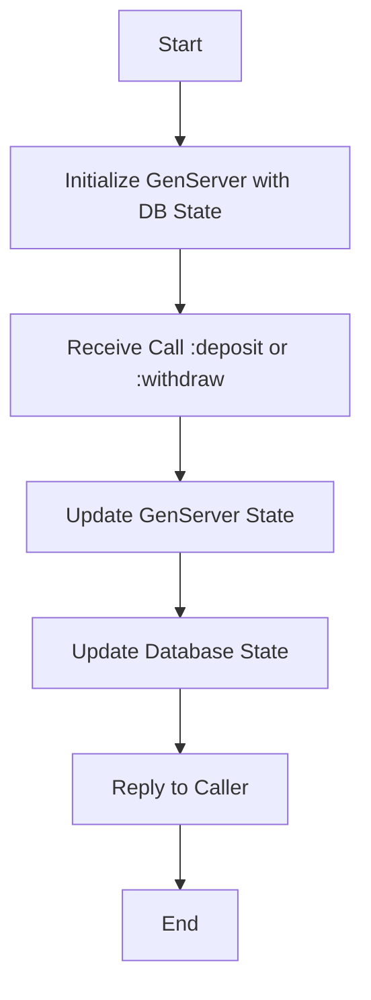

# TSBank Notes
## "Integrate" DB with Genserver (AKA Hydrating the Genserver State)

### Step 1: GenServer Initialization with Database State
When the GenServer starts, it should initialize its state with data from the database. We can search with t he account number.

```elixir

# In your GenServer module
def init(account_number) do
  
  # Fetch the initial balance from the database using Ecto

  account = TSBank.Repo.get_by!(TSBank.Accounts.Account, accountNumber: XXXXXXXXXX)

  {:ok, account.balance}
	
end
```

^^ get_by! raises a 'NoResultsError' if not found.
-> You could wrap everything in a try do, and then have a rescue with the NoResultsError. and return some error like {:error, :account_not_found}
-> Then start link can return this to the calling function.
-> Dont forget to log every step.


### Step 2: Update GenServer Callbacks for Database Interaction
The GenServer should update the database whenever it changes its state. For example, when you deposit or withdraw money.

#### Example for Deposit:
```elixir
def handle_call({:deposit, amount}, _from, balance) do
  new_balance = balance + amount
  
  # Get the account record from the database
  account = TSBank.Repo.get_by!(TSBank.Accounts.Account, accountNumber: "your_account_number_here")
  
  # Update the balance in the database
  TSBank.Repo.update!(%TSBank.Accounts.Account{account | balance: new_balance})

  {:reply, {:ok, new_balance}, new_balance}
end
```

### Step 3: your GenServer API functions you might need to interact with the database before or after they interact with the GenServer.

Example for Deposit API:
```elixir
def deposit(account_number, amount) do
  account = TSBank.Repo.get_by!(TSBank.Accounts.Account, accountNumber: account_number)
  GenServer.call(account.XXXXXXXXX, {:deposit, amount})
  
  # Update the database here if needed
  # Repo.update .......
  
end
```

Flowchart


For this flowchart:

Start.

Initialize GenServer with DB State: GenServer fetches initial state from the database.

Receive Call :deposit or :withdraw: GenServer receives a request to deposit or withdraw money.

Update GenServer State: GenServer updates its internal state based on the request.


## put_status messages

### 1xx: Informational
:continue - 100
:switching_protocols - 101
:processing - 102

### 2xx: Success
:ok - 200
:created - 201
:accepted - 202
:non_authoritative_information - 203
:no_content - 204
:reset_content - 205
:partial_content - 206
:multi_status - 207
:already_reported - 208
:im_used - 226

### 3xx: Redirection
:multiple_choices - 300
:moved_permanently - 301
:found - 302
:see_other - 303
:not_modified - 304
:use_proxy - 305
:switch_proxy - 306
:temporary_redirect - 307
:permanent_redirect - 308

### 4xx: Client Errors
:bad_request - 400
:unauthorized - 401
:payment_required - 402
:forbidden - 403
:not_found - 404
:method_not_allowed - 405
:not_acceptable - 406
:proxy_authentication_required - 407
:request_timeout - 408
:conflict - 409
:gone - 410
:length_required - 411
:precondition_failed - 412
:payload_too_large - 413
:uri_too_long - 414
:unsupported_media_type - 415
:range_not_satisfiable - 416
:expectation_failed - 417
:im_a_teapot - 418
:misdirected_request - 421
:unprocessable_entity - 422
:locked - 423
:failed_dependency - 424
:upgrade_required - 426
:precondition_required - 428
:too_many_requests - 429
:request_header_fields_too_large - 431

### 5xx: Server Errors
:internal_server_error - 500
:not_implemented - 501
:bad_gateway - 502
:service_unavailable - 503
:gateway_timeout - 504
:http_version_not_supported - 505
:variant_also_negotiates - 506
:insufficient_storage - 507
:loop_detected - 508
:not_extended - 510
:network_authentication_required - 511

Update Database State: GenServer updates the database to reflect the new state.

Reply to Caller: GenServer sends a reply back to the caller to confirm the operation.

End: The operation is complete.
