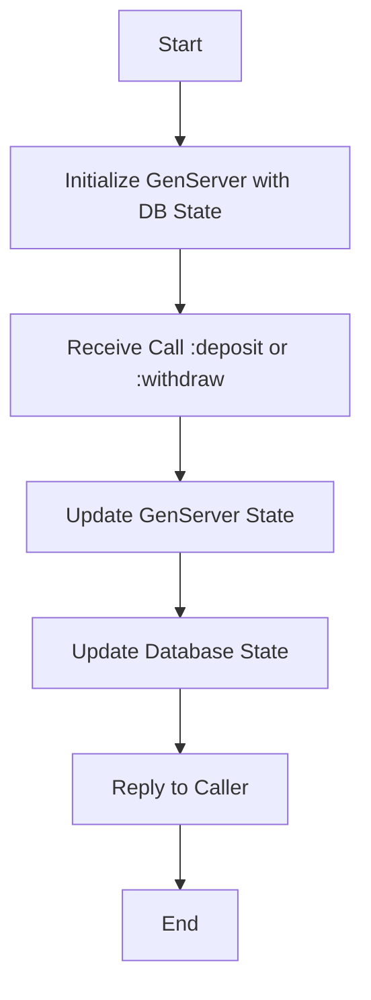

# TSBank Notes
## "Integrate" DB with Genserver (AKA Hydrating the Genserver State)

### Step 1: GenServer Initialization with Database State
When the GenServer starts, it should initialize its state with data from the database. We can search with t he account number.

```elixir

# In your GenServer module
def init(account_number) do
  
  # Fetch the initial balance from the database using Ecto

  account = TSBank.Repo.get_by!(TSBank.Accounts.Account, accountNumber: XXXXXXXXXX)

  {:ok, account.balance}
	
end
```

^^ get_by! raises a 'NoResultsError' if not found.
-> You could wrap everything in a try do, and then have a rescue with the NoResultsError. and return some error like {:error, :account_not_found}
-> Then start link can return this to the calling function.
-> Dont forget to log every step.


### Step 2: Update GenServer Callbacks for Database Interaction
The GenServer should update the database whenever it changes its state. For example, when you deposit or withdraw money.

#### Example for Deposit:
```elixir
def handle_call({:deposit, amount}, _from, balance) do
  new_balance = balance + amount
  
  # Get the account record from the database
  account = TSBank.Repo.get_by!(TSBank.Accounts.Account, accountNumber: "your_account_number_here")
  
  # Update the balance in the database
  TSBank.Repo.update!(%TSBank.Accounts.Account{account | balance: new_balance})

  {:reply, {:ok, new_balance}, new_balance}
end
```

### Step 3: your GenServer API functions you might need to interact with the database before or after they interact with the GenServer.

Example for Deposit API:
```elixir
def deposit(account_number, amount) do
  account = TSBank.Repo.get_by!(TSBank.Accounts.Account, accountNumber: account_number)
  GenServer.call(account.XXXXXXXXX, {:deposit, amount})
  
  # Update the database here if needed
  # Repo.update .......
  
end
```

Flowchart


For this flowchart:

Start.

Initialize GenServer with DB State: GenServer fetches initial state from the database.

Receive Call :deposit or :withdraw: GenServer receives a request to deposit or withdraw money.

Update GenServer State: GenServer updates its internal state based on the request.

Update Database State: GenServer updates the database to reflect the new state.

Reply to Caller: GenServer sends a reply back to the caller to confirm the operation.

End: The operation is complete.
