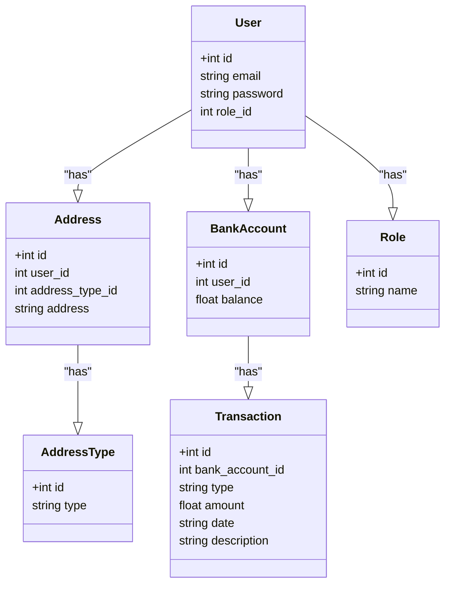
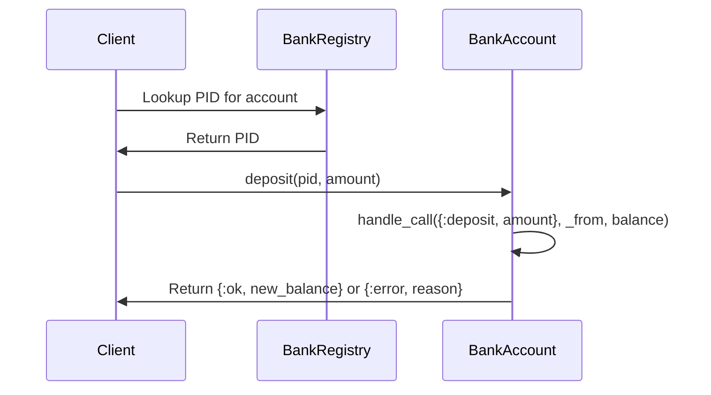
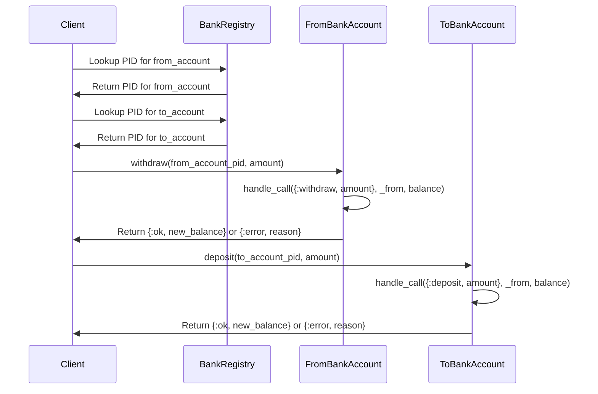
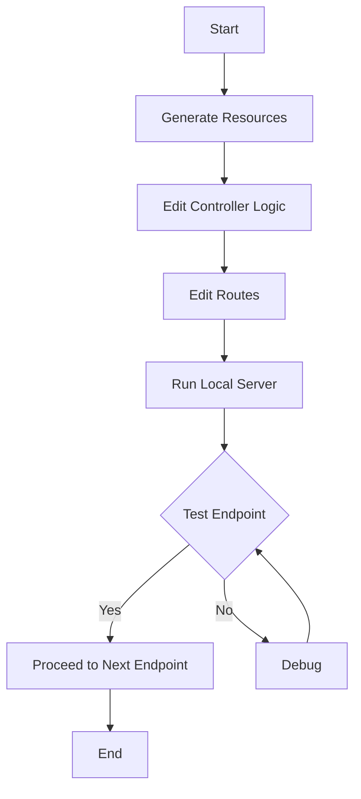
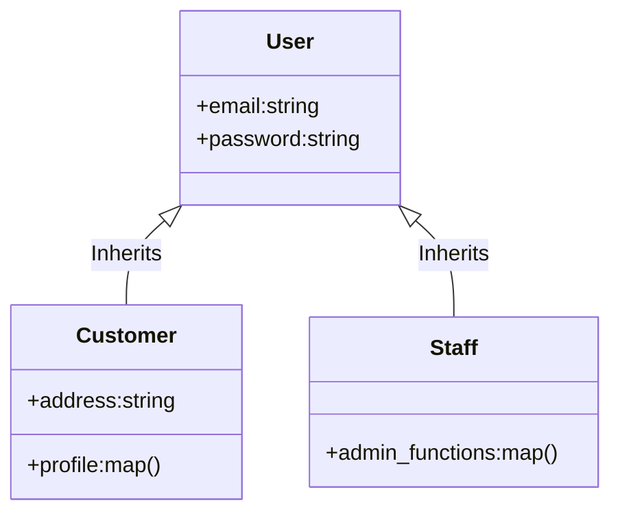
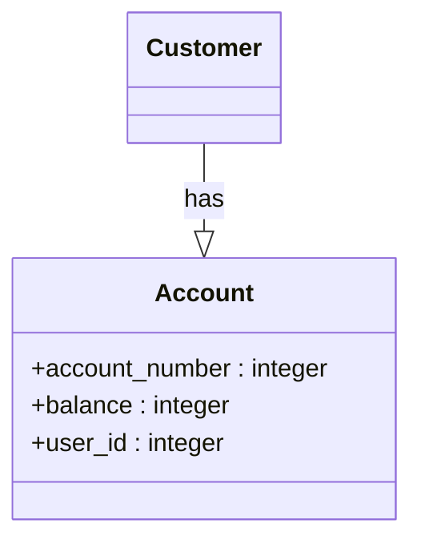
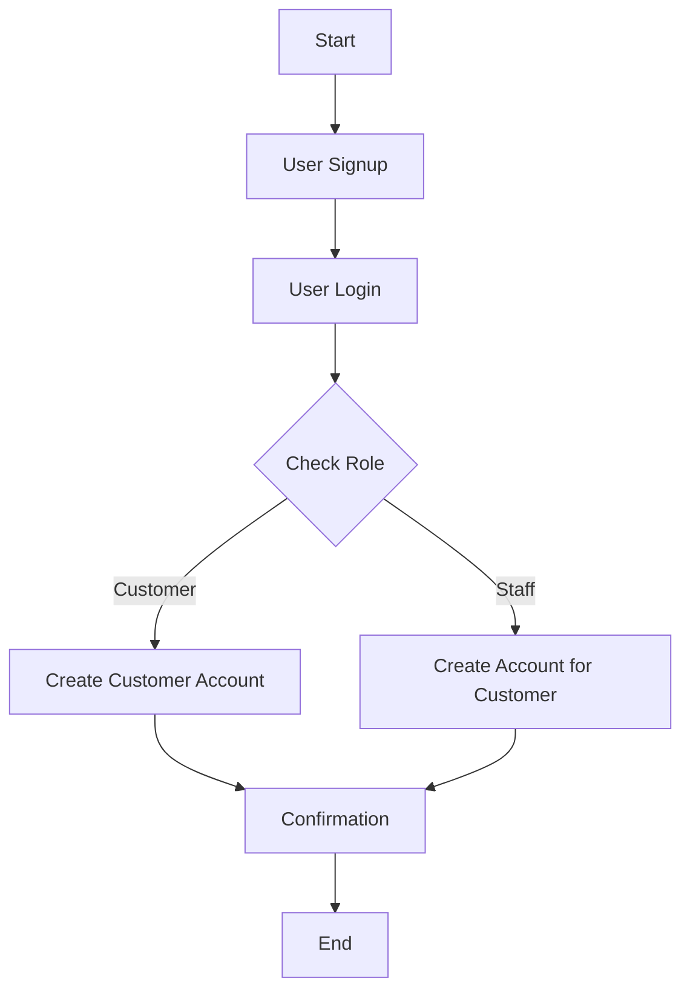

### Week's Detailed Task Guide for Building a Simple API Layer with Phoenix

Currently TSBank exposes the following public functions:

#### Transaction Module
-   No public functions are exposed; it defines a struct.

#### BankSupervisor Module
-   **`start_link/1`**: Starts the supervisor.

#### BankRegistry Module
-   **`start_link/0`**: Starts the unique registry for BankAccounts.

#### BankAccount Module

1.  **`start_link(account_number, initial_balance)`**: Starts the GenServer for a BankAccount with a given `account_number` and `initial_balance`.
2.  **`deposit(pid, amount)`**: Deposits the given `amount` into the bank account identified by the process ID `pid`.
3.  **`withdraw(pid, amount)`**: Withdraws the given `amount` from the bank account identified by the process ID `pid`.
4.  **`balance(pid)`**: Fetches the current balance of the bank account identified by the process ID `pid`.
5.  **`transfer(from_account, to_account, amount)`**: Transfers the given `amount` from the account identified by `from_account` to the account identified by `to_account`.


Sample high-Level Data Model -> This needs to be expanded to account for everything else, as well as the stuff we put on the flipchart.



The first priority is to expose these functions via API. We are going to rely and build on the learnings from the Jacob Leutzow videos as well as the other Phoenix tutorials we've done already.

Here is a list of endpoints required this week:


### Endpoints for Customers:

Note - An auth token must be passed in the request body headers

#### 1. Login for Customers

-   **Endpoint**: `POST /api/v1/customers/login`
-   **Description**: Authenticates a customer and returns an access token.
-   **Request Parameters**:
    -   `email`: Email address of the customer
    -   `password`: Customer's password
    - **Request Body**:
```
{
  "email": "customer@email.com",
  "password": "password123"
}
```
-   **Response**: JSON containing the access token or an error message.

#### 2. Create a New Account

-   **Endpoint**: `POST /api/v1/accounts`
-   **Description**: Creates a new bank account for the authenticated customer.
-   **Request Parameters**:
    -   `account_type`: Type of account to create (e.g., Savings, Checking)
- **Request Body**:
```
{
  "account_type": "Savings",
  "initial_balance": 1000
}
```
-   **Valid `account_type` values**: "Savings", "Cheque", "Transmission"
-   **Response**: JSON containing the account details or an error message.

#### 3. List All Accounts for a Customer

-   **Endpoint**: `GET /api/v1/customers/:customer_id/accounts`
-   **Description**: Lists all accounts associated with a particular customer.
-   **Response**: JSON array containing account details.

#### 4. View Specific Account

-   **Endpoint**: `GET /api/v1/accounts/:account_id`
-   **Description**: Retrieves the details of a specific account.
-   **Response**: JSON containing the account details.

#### 5. Deposit Money into Account

-   **Endpoint**: `POST /api/v1/accounts/:account_id/deposit`
-   **Description**: Deposits money into a specific account.
-   **Request Parameters**:
    -   `amount`: Amount to deposit
-   **Response**: JSON containing the new account balance.

Sequence Diagram for depositting money:


#### 6. Withdraw Money from Account

-   **Endpoint**: `POST /api/v1/accounts/:account_id/withdraw`
-   **Description**: Withdraws money from a specific account.
-   **Request Parameters**:
    -   `amount`: Amount to withdraw
-   **Response**: JSON containing the new account balance or an error message.

#### 7. Transfer Money Between Accounts

-   **Endpoint**: `POST /api/v1/transfer`
-   **Description**: Transfers money between two accounts owned by the same customer.
-   **Request Parameters**:
    -   `from_account_id`: Source account
    -   `to_account_id`: Destination account
    -   `amount`: Amount to transfer
-   **Response**: JSON containing the new balances for both accounts.

Sequence Diagram for Transfers:


----------

### Endpoints for Staff:

#### 1. Login for Staff

-   **Endpoint**: `POST /api/v1/admin/login`
-   **Description**: Authenticates a staff member and returns an access token.
-   **Request Parameters**:
    -   `email`: Email address of the staff
    -   `password`: Staff's password
-   **Response**: JSON containing the access token or an error message.

#### 2. View All Accounts (Admin)

-   **Endpoint**: `GET /api/v1/admin/accounts`
-   **Description**: Retrieves details of all accounts in the system.
-   **Response**: JSON array containing account details.

#### 3. View Specific Account (Admin)

-   **Endpoint**: `GET /api/v1/admin/accounts/:account_id`
-   **Description**: Retrieves the details of a specific account.
-   **Response**: JSON containing the account details.

#### 4. Create New Account for Customer (Admin)

-   **Endpoint**: `POST /api/v1/admin/accounts`
-   **Description**: Creates a new account for a specific customer.
-   **Request Parameters**:
    -   `customer_id`: ID of the customer
    -   `account_type`: Type of account (e.g., Savings, Checking)
-   **Response**: JSON containing the account details or an error message.

#### 5. Update Account Details (Admin)

-   **Endpoint**: `PUT /api/v1/admin/accounts/:account_id`
-   **Description**: Updates the details of a specific account.
-   **Request Parameters**: Varies depending on what is being updated (e.g., `account_type`)
-   **Response**: JSON containing the updated account details or an error message.

#### 6. Delete an Account (Admin)

-   **Endpoint**: `DELETE /api/v1/admin/accounts/:account_id`
-   **Description**: Deletes a specific account.
-   **Response**: JSON confirming the deletion or an error message.

----------

### General endpoints:

#### 1. Logout

-   **Endpoint**: `POST /api/v1/logout`
-   **Description**: Logs out the currently authenticated user, invalidating their token.
-   **Response**: JSON confirming logout.

----------

#### Phase 1: Initial Setup

1.  **Install Phoenix Framework**
    
    ```bash
    mix archive.install hex phx_new   
    ```
2.  **Create a New Phoenix Project**
    
    ```bash
    mix phx.new your_project_name		(TSBANK)
    ```
    
3.  **Navigate to the New Project Directory**
    
    ```bash
    cd your_project_name
    ```
    
4.  **Initialize Postgres Database**
    
   ```bash
    mix ecto.create
    mix ecto.migrate
```
5.  **Copy Existing Modules**

    -   Move `BankSupervisor`, `BankRegistry`, `BankAccount`, and any other modules into the `lib/` directory of your Phoenix project.
6.  **Update `mix.exs` File**
    
   ```bash
Example: Adding a dependency in mix.exs
defp deps do
  [
    {:some_dependency, "~> 1.0"}
  ]
end
```

-   Open your `mix.exs` file and add any dependencies that your existing modules may require.

7.  **Edit Supervision Tree in `application.ex`**
    
    -   Add `BankRegistry` and `BankSupervisor` to the `children` list:
    
   ```elixir
    children = [
      # ...
      BankRegistry,
      {BankSupervisor, arg_for_init},
      # ...
    ] 
   ```

----------

#### Phase 2: Building Endpoints



For each endpoint, you'll need to do the following:

1.  **Generate Resources**
2.  **Edit Controller Logic**
3.  **Edit Routes in `router.ex`**

**Customer Endpoints**

1.  **Login for Customers (`POST /api/v1/customers/login`)**
    
    -   **Generate Resources**: `mix phx.gen.json Auth CustomerLogin customers email:string password:string`
    -   **Edit Controller Logic**: Implement user authentication logic.
    -   **Edit Routes**: Add `post "/api/v1/customers/login", AuthController, :login` in `router.ex`.
    
    ...You can follow the same pattern for each customer endpoint
    
**Staff Endpoints**

1.  **Login for Staff (`POST /api/v1/staff/login`)**
    
    -   **Generate Resources**: `mix phx.gen.json Auth StaffLogin staff email:string password:string`
    -   **Edit Controller Logic**: Implement staff authentication logic.
    -   **Edit Routes**: Add `post "/api/v1/staff/login", StaffAuthController, :login` in `router.ex`.
    
    ... etc
    

**General Endpoints**

1.  **Logout (`POST /api/v1/logout`)**
    
    -   **Edit Controller Logic**: Implement logout logic to clear session/authorization token.
    -   **Edit Routes**: Add `post "/api/v1/logout", SessionController, :logout` in `router.ex`.

----------

##### 1. Login Endpoint (`POST /login`

##### User Authentication Endpoints


1.  **Generate Resources**
    
``` bash
mix phx.gen.json Auth User users email:string password:string
```
2.  **Edit Controller Logic**
    
    -   Implement a function to authenticate the user in `user_controller.ex`.
3.  **Edit Routes**
    
    ```elixir
    `post "/login", UserController, :login
    ```

----------

##### 2. Create Account Endpoint (`POST /accounts`)

    

1.  **Generate Resources**
    
    ```bash    
    mix phx.gen.json Accounts Account accounts account_number:integer:unique balance:integer
    ```
    
2.  **Edit Controller Logic**
    
    -   Implement a function to create a new bank account in `account_controller.ex`.
3.  **Edit Routes**
    
    ```elixir
    post "/accounts", AccountController, :create
    ```
----------

##### 3. Staff Login (`POST /staff/login`)
```mermaid
classDiagram
    Staff --|> Account : manages
    class Staff{
        +email : string
        +password : string
        +admin_functions : map
    }
 ```


1.  **Generate Resources**
    
    ```bash
	    mix phx.gen.json Staff StaffMember staff_members email:string password:string```
2.  **Edit Controller Logic**
    -   Implement a function to authenticate staff in `staff_member_controller.ex`.
3.  **Edit Routes**
    
    ```elixir
    post "/staff/login", StaffMemberController, :login
    ```

----------

##### 4. List All Bank Accounts (`GET /accounts`)

1.  **Edit Controller Logic**
    
    -   Implement a function to list all accounts in `account_controller.ex`.
2.  **Edit Routes**
    
```elixir
    get "/accounts", AccountController, :index
    ```

----------

##### 5. Get Specific Account (`GET /accounts/:id`)

1.  **Edit Controller Logic**
    
    -   Implement a function to show a specific account in `account_controller.ex`.
2.  **Edit Routes**
    
```elixir
get "/accounts/:id", AccountController, :show` 
```    

----------
Transactions have 
```mermaid
classDiagram
    Account --|> Transaction : has
    class Transaction{
        +type : string
        +amount : integer
        +date : datetime
        +description : string
    }
   ```


##### 6. Deposit Money (`POST /accounts/:id/deposit`)

1.  **Edit Controller Logic**
    
    -   Implement a function to deposit money into an account in `account_controller.ex`.
2.  **Edit Routes**
    
```elixir
post "/accounts/:id/deposit", AccountController, :deposit
```    
----------
##### 7. Withdraw Money (`POST /accounts/:id/withdraw`)
1.  **Edit Controller Logic**

    -   Implement a function to withdraw money from an account in `account_controller.ex`.
2.  **Edit Routes**
    
```elixir
post "/accounts/:id/withdraw", AccountController, :withdraw
```    
----------

##### 8. Transfer Money (`POST /transfer`)

1.  **Edit Controller Logic**
    
    -   Implement a function to transfer money between accounts in `account_controller.ex`.
2.  **Edit Routes**
    
```elixir    
   post "/transfer", AccountController, :transfer
   ```


### Flow of Use Cases

#### Creating a Bank Account

1.  **User Signup / Staff Onboarding**
    
    -   First, a user (either a customer or staff member) needs to be registered in the system.
    -   Endpoint: `POST /api/v1/signup`
    -   For staff, you may use a different endpoint or a flag to indicate it's a staff member being registered.
2.  **User Login**
    
    -   After signup, the user needs to log in to get an authentication token.
    -   Endpoint for customers: `POST /api/v1/customers/login`
    -   Endpoint for staff: `POST /api/v1/staff/login`
    
    **Questions to Consider**:
    
    -   Is the user already logged in? If yes, skip to step 3.
3.  **Check User Role**
    
    -   The API needs to verify if the logged-in user has the permissions to create a bank account.
4.  **Create a Bank Account**
    
    -   Now the user or staff can create a bank account.
    -   Endpoint for customers: `POST /api/v1/accounts`
    -   Endpoint for staff (if they have permissions): `POST /api/v1/admin/accounts`
    -   The API will check the user's role to see if they are authorized to perform this action.
5.  **Confirmation**
    
    -   Once the bank account is created, a confirmation is sent to the user.


1.  **Listing All Accounts**
    
    -   After login, either customer or staff can view a list of accounts.
    -   Customer endpoint: `GET /api/v1/customers/:customer_id/accounts`
    -   Staff endpoint: `GET /api/v1/admin/accounts`
2.  **Depositing Money**
    
    -   Endpoint: `POST /api/v1/accounts/:account_id/deposit`
3.  **Withdrawing Money**
    
    -   Endpoint: `POST /api/v1/accounts/:account_id/withdraw`
4.  **Transferring Money**
    
    -   Endpoint: `POST /api/v1/transfer`
5.  **Viewing Transactions**
    
    -   Endpoint: `GET /api/v1/accounts/:account_id/transactions`
6.  **Logging Out**
    
    -   Endpoint: `POST /api/v1/logout`


----------

### Phase 3: Database Integration

In this phase, we will focus on integrating the database using Ecto. Ecto is a database wrapper and query generator that works seamlessly with Phoenix. You'll be defining schemas, implementing repository functions, and migrating the database.

#### Steps

1.  **Environment Setup for Database**
    
    -   **Install Postgres**: If not already installed, ensure PostgreSQL is installed.
    -   **Configure**: Update `/config/dev.exs` with the database credentials.
2.  **Create or Modify Ecto Schemas**
    
    -   **What is an Ecto Schema?**: Ecto schemas are used to map any data source into an Elixir struct. They define what the data looks like in a particular table.
        
    -   **Location**: Create a new Elixir file within the `lib/your_app/schemas/` folder for each model.
```defmodule YourApp.Account do
  use Ecto.Schema

  schema "accounts" do
    field :account_number, :integer
    field :balance, :integer
    field :user_id, :integer

    timestamps()
  end
end
```
-   -   **Associations**: If your models have associations like `has_many` or `belongs_to`, specify them in the schema.
        
-   **Implement Repo Functions**
    
    -   **What is a Repo?**: A repository in Ecto maps to an actual database. It’s the main way your application will interact with your database.
        
    -   **Location**: Create a new Elixir file within `lib/your_app/repos/` folder.
        
    -   **Common Functions**:
        
        -   `Repo.get(Account, id)`: To fetch a record.
        -   `Repo.insert!(%Account{params})`: To insert a new record.
        -   `Repo.update!(account)`: To update a record.
        -   `Repo.delete!(account)`: To delete a record.
    -   **Implement**: Write the necessary repo functions that your endpoints will use.
        
-   **Run Migrations**
    
    -   **What are Migrations?**: Migrations are a way to create or alter database schema in a structured and organized manner.
        
    -   **Command**: Run `mix ecto.migrate` to create or update the tables in your database according to the schemas.
        
    -   **Rollback**: To rollback a migration, you can use `mix ecto.rollback`.
        
-   **Seed Data**
    
    -   **What is Seeding?**: Seeding a database is a process in which an initial set of data is provided to a database when it is being installed.
        
    -   **Location**: Update or create a `seeds.exs` file within `priv/repo/`.
        
    -   **How to Seed**: Use `Repo.insert!` to add initial data.
        
    -   **Run Seeds**: Use `mix run priv/repo/seeds.exs` to populate the database.
        
-   **Test Database Operations**
    
    -   Once you've completed the above steps, run tests to make sure all database operations are working as expected.
-   **Commit Changes**
    
    -   After testing, commit your changes to your version control system.

## Steps

1.  **Create or Modify Ecto Schema**:
    -   For each model, create an Ecto schema in a new file within the `schemas` folder.
    -   This schema will map to a table in the PostgreSQL database.
    -   For example, for the `Account` model, you might have fields like `account_number`, `balance`, and `user_id`.

2.  **Implement Repo Functions**:
    -   In a new file within the `repos` folder, implement functions for database operations such as `insert`, `update`, `delete`, and `get`.
    -   You can use Ecto's `Repo` module for this.
3.  **Migrate Database**: After creating or modifying Ecto schemas, run `mix ecto.migrate` to apply the changes to your database.
    
4.  **Seed Data**: Optionally, you can add some seed data to your database by editing the `seeds.exs` file in the `priv/repo/seeds.exs` directory.

----------


### Phase 4: Error Handling

#### Objective

To implement robust error-handling mechanisms in each controller method to manage unexpected scenarios and provide informative responses to the client.

#### Strategies

1.  **Use `with` Statements**: Utilize Elixir's `with` statement for cleaner error handling when dealing with multiple operations that could fail.
    
    -   The `with` statement allows you to chain multiple functions that return `{:ok, result}` or `{:error, reason}` tuples and handle errors in a single `else` block.
    
    **Example**:
    
```elixir
    with {:ok, user} <- find_user(params["user_id"]),
         {:ok, account} <- create_account(user, params["account_type"]) do
      {:ok, "Account successfully created"}
    else
      {:error, reason} -> {:error, "Failed to create account: #{reason}"}
    end` 
```
    
2.  **Use `case` Statements**: For simpler scenarios or when you need to pattern-match on multiple conditions, a `case` statement can be useful.
    
    **Example**:
    
```elixir
case authenticate_user(params["username"], params["password"]) do
      {:ok, user} -> {:ok, "Authenticated successfully"}
      {:error, :user_not_found} -> {:error, "User not found"}
      {:error, :invalid_password} -> {:error, "Invalid password"}
      _ -> {:error, "An unknown error occurred"}
      end
```
    
#### Guidelines

-   **HTTP Status Codes**: Always return appropriate HTTP status codes along with the error message. For example, return a 400 for bad requests, 401 for unauthorized access, etc.
    
-   **Logging**: Use Elixir's Logger module to log errors for debugging purposes.
    
-   **Consistency**: Maintain a consistent error response format. Typically, a JSON object with a `message` or `error` key is used.
    
    **Example**:
```json
{
      "error": "Invalid credentials provided",
      "status": 401
}
```
    
-   **Test Error Scenarios**: While writing tests, make sure to cover error cases to validate that your error handling is working as expected.

----------


### Phase 5: Testing

#### Objective

To write comprehensive tests for each API endpoint, covering both successful operations and error scenarios, using Phoenix's extensive testing capabilities.

#### Strategies

1.  **Initialize Test Environment**
    
    -   Before writing tests, make sure your test environment is properly configured. This includes your test database and any necessary configurations in your `config/test.exs` file.
2.  **Write Test Cases for Each Endpoint**
    
    -   Use the `ExUnit` framework along with Phoenix's testing support to write tests for each controller action.
    
    **Example**:
    
```elixir    
    `test "GET /api/v1/accounts/:id", %{conn: conn} do
      conn = get(conn, "/api/v1/accounts/1")
      assert json_response(conn, 200)["data"]["id"] == "1"
    end
```
   -   **Positive Tests**: Test the cases where the operation should succeed. Check the status code, response format, and any changes in the database.
    -   **Negative Tests**: Test the cases where the operation should fail. For example, try to create an account with an already existing account number, or attempt an unauthorized access.
3.  **Cover Edge Cases**
    
    -   Ensure that you write tests for any edge cases you can think of. For example, what happens if a deposit amount is negative or if a user tries to withdraw more money than they have?
4.  **Utilize Fixtures or Factories**
    
    -   If your tests require specific conditions to be met in the database (e.g., a user must exist before an account can be created), use fixtures or factories to set up this data.

"Fixtures" and "Factories" are both techniques used in automated testing to manage and set up the initial state of your system before running the tests. They help you create the necessary data and conditions that your test needs to run correctly. Let's break down each term:

#### Fixtures

A fixture is a known set of data that the tests use as a baseline. This could be a pre-defined set of records in your database, like users, accounts, or transactions. Before running the tests, these records are loaded into the test database to mimic a real-world scenario.

**Example in Elixir/Phoenix:**

Let's say you have a file `test/fixtures/users_fixture.exs` with the following content:
```elixir
`alias MyApp.Accounts
Accounts.create_user(%{email: "test@example.com", password: "test123"})` 
```

You can run this file in your test setup to ensure that a user is present in the database:
```elixir
setup do
  MyApp.Repo.delete_all(MyApp.User)
  Code.eval_file("test/fixtures/users_fixture.exs")
  :ok
end
```

#### Factories

Factories are more dynamic than fixtures. They are functions or modules that allow you to create objects on-the-fly, often with randomized or sequentially increasing data. Factories give you more control and flexibility, as you can easily override default values for specific tests.

A popular library for defining factories in Elixir is [ExMachina](https://github.com/thoughtbot/ex_machina).

**Example using ExMachina:**

First, you define a factory module:

```elixir
defmodule MyApp.Factory do
  use ExMachina.Ecto, repo: MyApp.Repo
  def user_factory do
    %MyApp.User{
      email: sequence(:email, &"test#{&1}@example.com"),
      password: "test123"
    }
  end
end
```
			
Then, in your tests, you can use this factory to insert a user:

```elixir
insert(:user)  # Inserts a user with a unique email and password "test123"` 
```
Or insert a user with overridden attributes:
```elixir
insert(:user, email: "override@example.com")  # Overrides the email
```

#### Which to Use?

-   **Fixtures**: Good for setting up a known, fixed environment. Easier to reason about but can be inflexible.
-   **Factories**: Better for tests that require unique or varied conditions. More flexible but can make tests a bit harder to reason about due to variability.

### Guidelines

-   **Run All Tests Regularly**: After writing a set of tests, run them to make sure they all pass. Keep an eye out for flaky tests that pass or fail intermittently.
    
    bashCopy code
    
    `mix test` 
    
-   **Review Test Coverage**: While 100% test coverage is not always achievable or necessary, aim for a high percentage of code coverage. Tools like `excoveralls` can help analyze your test coverage.
    
    bashCopy code
    
    `mix coveralls.html` 
    
-   **Continuous Integration**: Consider setting up a CI/CD pipeline that runs your test suite automatically when code changes are pushed to your repository.
    
-   **Documentation**: Document any non-obvious parts of your tests to make it easier for other developers to understand why a particular test exists.

----------

#### Phase 6: Documentation

1.  Update the `README.md` with setup instructions, how to use the API, and how to run tests.
